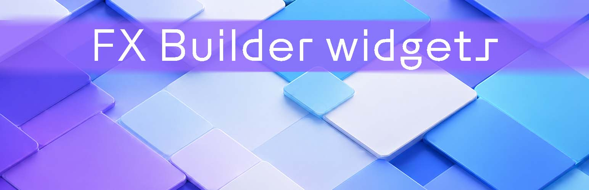

# FX Builder widgets
Display [FX Builder](https://github.com/wolffe/fx-builder) pages as widgets.

You can use the widget to display any FX Builder content.
If you don't want to put your content in a post or page, *FX Builder widget contents* is a custom post type that allows you to compose your content.

Create the widget, select the content, decide if you want the title to be shown. Just this.

## Usage steps

1. In *"FX Builder widget contents"* admin, create or edit a post. It's like any posts or pages with FX Builder enabled.
2. Find the *"FX Builder contents"* widget and put in the desired section.
3. Choose the content to display from the dropdown. You'll find FX Builder widget contents posts as long as any post or page using FX Builder.
4. Use the *"Show title"* checkbox to choose to display post title or not.

## Customizations

### Delete FX Builder widget contents on uninstall
By default the plugins leave the custom post in the database.
If you want to remove on uninstall, put in `wp-config.php` this code:

`define ( 'FBW_REMOVE_CONTENT_ON_UNINSTALL', true );` 

### Disable custom post type
If you don't need it, put in an utility mu-plugin or in your theme `functions.php` this code:

`add_filter( 'fbw_disable_cpt', '__return_true' );`

